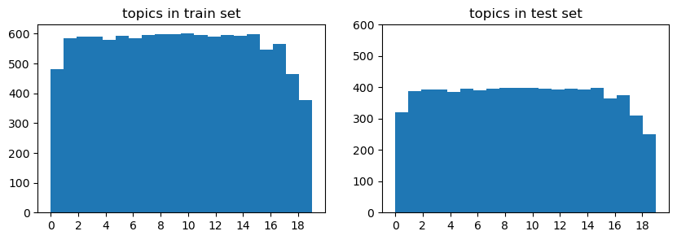
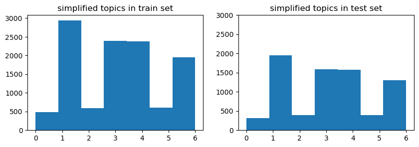
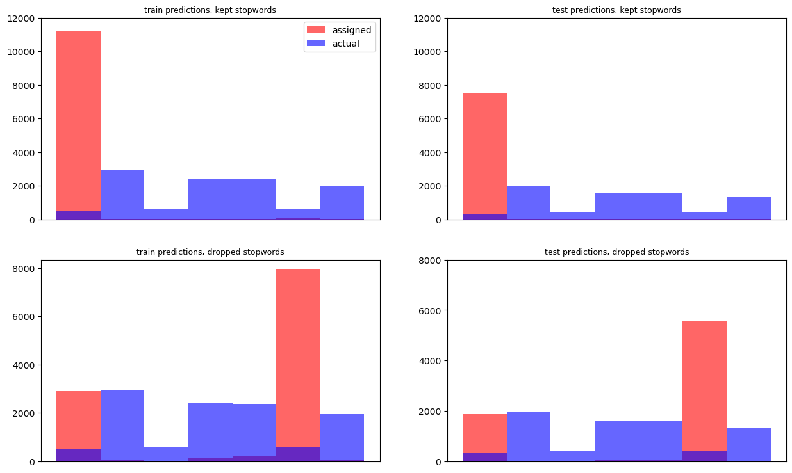

# LLM Project

## Project Task
I chose the **Topic Modelling task**, which involves taking text from the `20_newsgroups` dataset and sorting it into groups based on the text's content. 

## Dataset
The `20_newsgroups` dataset comes presplit into training and testing sets, both prelabeled with true categories, both as a numerical value and a string. These string values reveal that the categories are the end result of breaking down larger, less specific categories into more granular ones. There are 11.3k items in the training set, and 7.5k in the test set, with a nearly uniform distribution across the 20 categories present.

## Preprocessing
I decided that trying to get the model to detect 20 categories was too much for a first-time LLM, so I reduced the total category count. Looking at the `label_text` column showed that each category is actually a string of classifications, so I used the broadest category to condense the 20 labels down to 7.

|Grouping|Included Labels|
|---|---|
|alt|alt.atheism|
|comp|comp.graphics  comp.os.ms-windows.misc  comp.sys.ibm.pc.hardware  comp.sys.mac.hardware  comp.windows.x|
|misc|misc.forsale|
|rec|rec.autos  rec.motorcycles  rec.sport.baseball  rec.sport.hockey|
|sci|sci.crypt  sci.electronics  sci.med  sci.space|
|soc|soc.religion.christian|
|talk|talk.politics.guns  talk.politics.mideast  talk.politics.misc  talk.religion.misc|

This resulted in a change in the distribution of the categories; initially, the 20 topic categories had a nearly uniform distribution:

However, some of the new categories only have one category feeding into them, while others have four or more, which results in this distribution of the new categories:

The fact that there are 3 under represented categories was a source of concern while building the model. 

The next step was to clean each entry before passing it to the model. This process involved:<ul>
- removing newline characters 
- removing html tags 
- removing URLs 
- removing email addresses 
- removing punctuation 
- converting all letters to lowercase</ul>

After this processing, stopwords were removed. 

Below is an example of this process on one entry, showing how it changed at each step.

>Unprocessed Text
>>"From article <C5owCB.n3p@world.std.com>, by tombaker@world.std.com (Tom A Baker):\n\n\nMy understanding is that the 'expected errors' are basically\nknown bugs in the warning system software - things are checked\nthat don't have the right values in yet because they aren't\nset till after launch, and suchlike. Rather than fix the code\nand possibly introduce new bugs, they just tell the crew\n'ok, if you see a warning no. 213 before liftoff, ignore it'." 

>
>Processed 
>>'from article  by  tom a baker   my understanding is that the expected errors are basically known bugs in the warning system software  things are checked that dont have the right values in yet because they arent set till after launch and suchlike rather than fix the code and possibly introduce new bugs they just tell the crew ok if you see a warning no 213 before liftoff ignore it'
>
>Stopwords Removed
>>'article tom baker understanding expected errors basically known bugs warning system software things checked dont right values yet arent set till launch suchlike rather fix code possibly introduce new bugs tell crew ok see warning 213 liftoff ignore'

For comparison, the total numbers of words present in each set, before and after the removal of stopwords are:

|Section|Stopwords|Total  |Unique |
|-------|---------|------:|------:|
|Train  |With     |2036545|  94761|
|Train  |Without  |1150420|  94622|
|       |         |       |       |
|Test   |With     |1285775|  68554|
|Test   |Without  | 723349|  68415|

 

## Representation with SKLearn
I wanted to see if there was a difference in performance when stopwords were dropped versus when they were not, so I had a column for each version of the cleaned data; `preprocess`, where only the preprocessing had been done, and `no_stopword` where the stopwords had also been dropped. 

Each of the columns was run through SKLearn's `TfidVectorizer` to convert the words into numeric arrays, and then `LatentDirichletAllocation` (LDA) was used to attempt to assign categories to each document. Below are graphs comparing the actual topic categories to what LDA assigned them.

Clearly, this model did not do a very good job. However, it did do slightly better when the stopwords were removed, which is what I expected to see. The exact accuracy can be seen here:

|Section|Stopwords|Accuracy|
|-------|---------|-------:|
|Train  |With     |   4.38%|
|Test   |With     |   4.24%|
|       |         |        |
|Train  |Without  |   6.71%|
|Test   |Without  |   5.87%|

 

## Pre-trained Model
The pretrained model I used was DistilBert, and more specifically the `DistilBertForSequenceClassification`. It has the paired tokenizer DistilBertTokenizer, which I used for tokenization prior to training the model. Both were initialized using the pretrained instance `distilbert-base-uncased`. 

I chose this model as, from the ones we discussed, this was the one suited to the task I had chosen, which was confirmed when it showed up on the HuggingFace directory when I searched by task. I then chose the offshoot version of the model because it is very specifically suited to my task.

## Performance Metrics
Because this is a classification task, to the best of my knowledge and as far as I can find, the model by default uses a cross-entropy loss function to evaluate its progress. This only happens if it is given labeled data during training, but my dataset *is* labeled, so it was produced. 

Given I have 7 labels, random guessing would give a loss score of around 1.95, while the model had a training loss of only 0.81 and a final training loss of 0.52 on the train set and 0.63 on the test set. 

I also used accuracy and f1, as with classification the goal is to be correct. On evaluation, the accuracy scores were 82% to 77%, and the f1 was 0.80 to 0.76. Because I altered the number of categories I was working with and created under-represented categories, it was important to also have the f1 score, as it is potentially more sensitive to imbalanced data. However, both metrics show similar performance and similar drops between the training and testing sets. This model, even with very basic parameters and one round of training, performs quite well; miles better than the SKLearn attempt, and also than complete randomness, which would be 1/7 or about 14%.

Getting the accuracy and f1 also produced a new pair of loss values, and I am not entirely sure if those are for the trained model, while the others were for the in-training model, or if something else was going on. But the loss scores produced by the evaluate trainer method showed as lower. This makes sense if they are from the trained model. 

## Hyperparameters
I did very little parameter tuning on the actual model that I ran, both as a result of the initial version that ran in collab taking 7 hours to run, and because I still don't have a very good understanding of what the various parameters do. Most of the parameters on the tokenzier didn't seem to apply in my case, or where already the way I needed them by default. The only task-specific parameter I passed to the model was the number of labels, and that wouldn't change with tuning. I don't think I know enough to say what parameters I could tune to get better results, and that is likely because I don't know that they exist.  

## Relevant Links
[Model](https://huggingface.co/distilbert/distilbert-base-uncased)
[Dataset](https://huggingface.co/datasets/SetFit/20_newsgroups)
