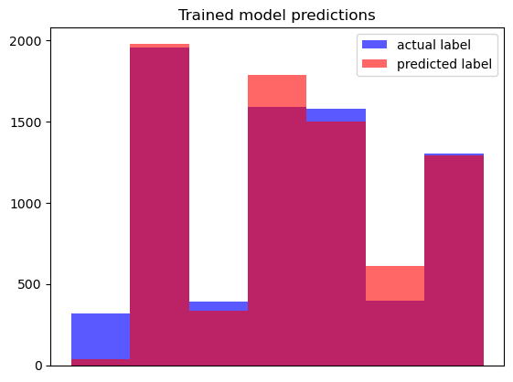

# LLM Project

## Project Task
I chose the **Topic Modelling task**, which involves taking text from the `20_newsgroups` dataset and sorting it into groups based on the text's content. 

## Dataset
The `20_newsgroups` dataset comes presplit into training and testing sets, both prelabeled with true categories, both as a numerical value and a string. These string values reveal that the categories are the end result of breaking down larger, less specific categories into more granular ones. There are 11.3k items in the training set, and 7.5k in the test set, with a nearly uniform distribution across the 20 categories present.

## Preprocessing
I decided that trying to get the model to detect 20 categories was too much for a first-time LLM, so I reduced the total category count. Looking at the `label_text` column showed that each category is actually a string of classifications, so I used the broadest category to condense the 20 labels down to 7.

|Grouping|Included Labels|
|---|---|
|alt|alt.atheism|
|comp|comp.graphics  comp.os.ms-windows.misc  comp.sys.ibm.pc.hardware  comp.sys.mac.hardware  comp.windows.x|
|misc|misc.forsale|
|rec|rec.autos  rec.motorcycles  rec.sport.baseball  rec.sport.hockey|
|sci|sci.crypt  sci.electronics  sci.med  sci.space|
|soc|soc.religion.christian|
|talk|talk.politics.guns  talk.politics.mideast  talk.politics.misc  talk.religion.misc|

This resulted in a change in the distribution of the categories; initially, the 20 topic categories had a nearly uniform distribution:

However, some of the new categories only have one category feeding into them, while others have four or more, which results in this distribution of the new categories:

The fact that there are 3 under represented categories was a source of concern while building the model. 

The next step was to clean each entry before passing it to the model. This process involved:<ul>
- removing newline characters 
- removing html tags 
- removing URLs 
- removing email addresses 
- removing punctuation 
- converting all letters to lowercase</ul>

After this processing, stopwords were removed. 

Below is an example of this process on one entry, showing how it changed at each step.

>Unprocessed Text
>>"From article <C5owCB.n3p@world.std.com>, by tombaker@world.std.com (Tom A Baker):\n\n\nMy understanding is that the 'expected errors' are basically\nknown bugs in the warning system software - things are checked\nthat don't have the right values in yet because they aren't\nset till after launch, and suchlike. Rather than fix the code\nand possibly introduce new bugs, they just tell the crew\n'ok, if you see a warning no. 213 before liftoff, ignore it'." 

>
>Processed 
>>'from article  by  tom a baker   my understanding is that the expected errors are basically known bugs in the warning system software  things are checked that dont have the right values in yet because they arent set till after launch and suchlike rather than fix the code and possibly introduce new bugs they just tell the crew ok if you see a warning no 213 before liftoff ignore it'
>
>Stopwords Removed
>>'article tom baker understanding expected errors basically known bugs warning system software things checked dont right values yet arent set till launch suchlike rather fix code possibly introduce new bugs tell crew ok see warning 213 liftoff ignore'

For comparison, the total numbers of words present in each set, before and after the removal of stopwords are:

|Section|Stopwords|Total  |Unique |
|-------|---------|------:|------:|
|Train  |With     |2036545|  94761|
|Train  |Without  |1150420|  94622|
|       |         |       |       |
|Test   |With     |1285775|  68554|
|Test   |Without  | 723349|  68415|

 

## Representation with SKLearn
I wanted to see if there was a difference in performance when stopwords were dropped versus when they were not, so I had a column for each version of the cleaned data; `preprocess`, where only the preprocessing had been done, and `no_stopword` where the stopwords had also been dropped. 

Each of the columns was run through SKLearn's `TfidVectorizer` to convert the words into numeric arrays, and then `LatentDirichletAllocation` (LDA) was used to attempt to assign categories to each document. Below are graphs comparing the actual topic categories to what LDA assigned them.

Clearly, this model did not do a very good job. However, it did do slightly better when the stopwords were removed, which is what I expected to see. The exact accuracy can be seen here:

|Section|Stopwords|Accuracy|
|-------|---------|-------:|
|Train  |With     |   4.38%|
|Test   |With     |   4.24%|
|       |         |        |
|Train  |Without  |   6.71%|
|Test   |Without  |   5.87%|

This accuracy result is accually _worse_ than random chance would be (~14%), which implies that the model is learning _something_, but not at all the right things. 

 

## Pre-trained Model
The pretrained model I used was DistilBert, and more specifically the `DistilBertForSequenceClassification`. It has the paired tokenizer `DistilBertTokenizer`, which I used for tokenization prior to training the model. Both were initialized using the pretrained instance `distilbert-base-uncased`. 

I chose this model as, from the ones we discussed, this was the one suited to the task I had chosen, which was confirmed when it showed up on the HuggingFace directory when I searched by task. I then chose the offshoot version of the model because it is very specifically suited to my task.

 

## Exploring Pipelines
For compatibility with HuggingFace environments, I created a new DatasetDict object using the `no_stopword` column, the new label categories I created (renamed to 'label', again for compatibility), and the original label text.

I attempted to use HuggingFace's built in pipelines, but I had problems getting reasonable outputs from it. Even though I gave it the number of categories I was looking for, it had a tendency to only use two of the options. Asking it to only process a small fraction of the data resulted in more of the labels being used, but the labels did not match up to the target labels, and as I was unsure as to how do control what the pipeline was doing internally, I decided to proceed by doing the entire process step by step in another notebook.

 

## Model Training
To set up and train the model without using a pipeline, the first step was to tokenize the data, and initiate the model. Tokenization was set to allow padding and truncation, as I encountered issues with tensor length limits without those settings, and also with batching enabled to ensure there were no memory issues. The model was initiated with the only special parameter being the target number of categories. 

I also needed to create a way to evalute the performance of the model during training. I chose to use both **accuracy** and the **F1** score; including the F1 score was especially important in this case due to the 3 categories that were under represented in my simplified categories.

The `Trainer` took the model, tokenizer, and performance metrics function as arguments, as well as specification of training vs test datasets. It also looked at the DatasetDict item's `label` columns, which it uses for the evaluation of the model. 

### Training Results
To get a rough idea of how well the model had done, I first plotted the model's predicted labels over the actual labels from the data.

This shows that the model did a good job of learning two of the three under represented categories, but completely missed the third.

Because this is a classification task, to the best of my knowledge and as far as I can find, the model by default uses a cross-entropy loss function to evaluate its progress. This only happens if it is given labeled data during training, but my dataset *is* labeled, so it was produced. 

During training, two loss values were produced; I am unsure what stage of training the first value is from, but the second is from the final step. I got the results for the train and test datasets specifically after running the `trainer.evalute` method on each. 

To give a yardstick of how well the model was doing, while charting the evaluation metrics, I included a column for how well a random chance classifier would be expected to do on the same task. Given that I have 7 categories, the loss score would be expected to be around 1.95, and the accuracy and f1 would both be expected to be around 0.14. 

There is a small drop between the two loss values produced during training, and then the values for the train and test datasets individually are smaller again, although there is an increase between train and test. All of these values are a significant improvement over the value that would be expected from random chance however; even the first training value is less than half of the random chance value. 

Looking at accuracy and f1, they both dramatically outperform random chance. There is a drop from the train set to the test set, which is to be expected, and there is also a decrease between the accuracy and the f1 score. This is also expected, given that the first chart in this section shows one of the categories was missed entirely, but the drop is not a large one. Below are tables of the exact values.

|Chart label|Loss value|
|-----------|---------:|
|Training 1 |     0.881|
|Training 2 |     0.806|
|Eval: Train|     0.521|
|Eval: Test |     0.632|

|Chart label|Accuracy|F1   |Difference| 
|-----------|-------:|----:|---------:|
|Eval: Train|   0.818|0.802|     0.016|
|Eval: Test |   0.774|0.759|     0.015|
|           |        |     |          |
|Drop       |0.044   |0.043|     -----|

Given the model's consistent performance between the train and test sets, as well as between accuracy and f1, along with the loss score being quite good for a 7 option classification task, this model is performing very well on the task, especially considering no hyperparameters were tuned and only one round of training was performed. 

 

## Relevant Links
[Model](https://huggingface.co/distilbert/distilbert-base-uncased) 
[Dataset](https://huggingface.co/datasets/SetFit/20_newsgroups)
